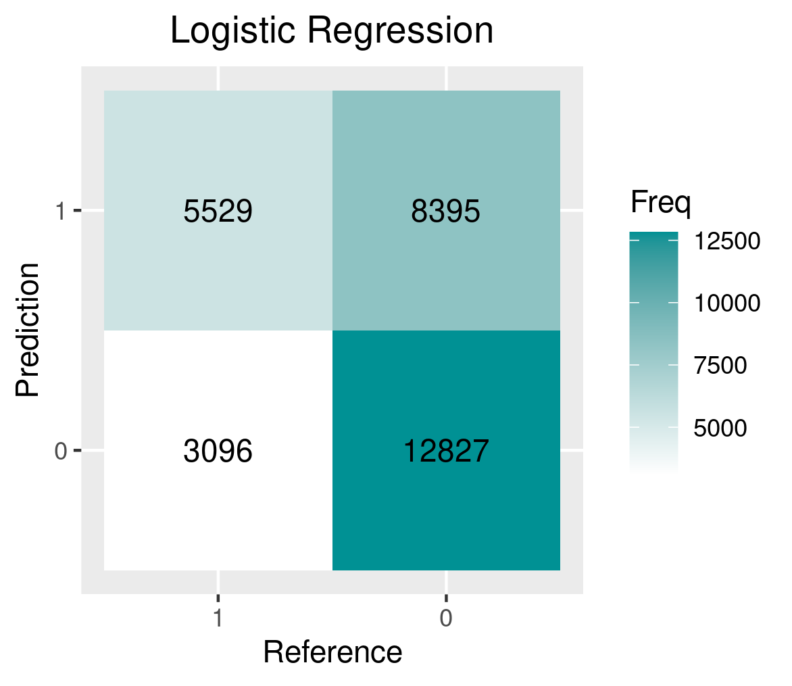
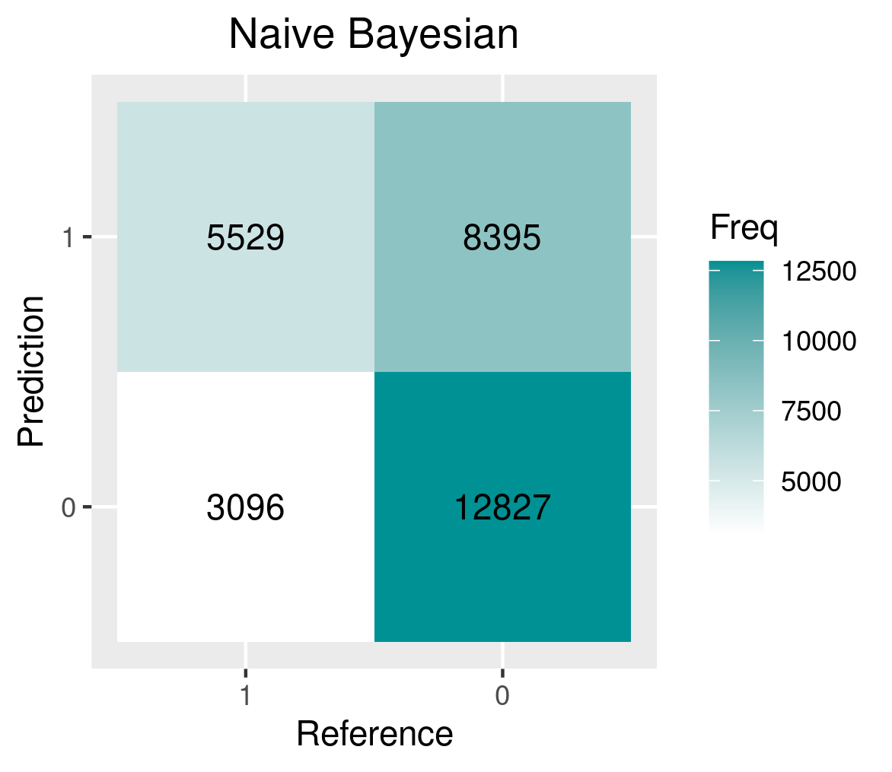
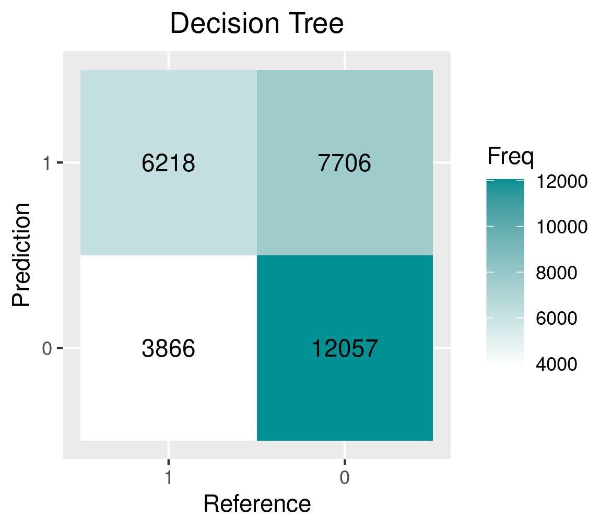
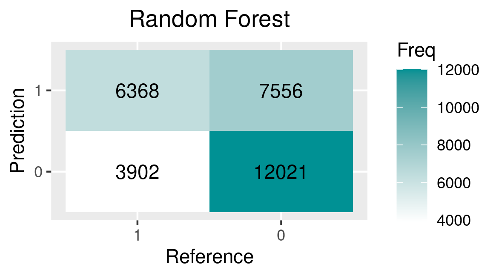
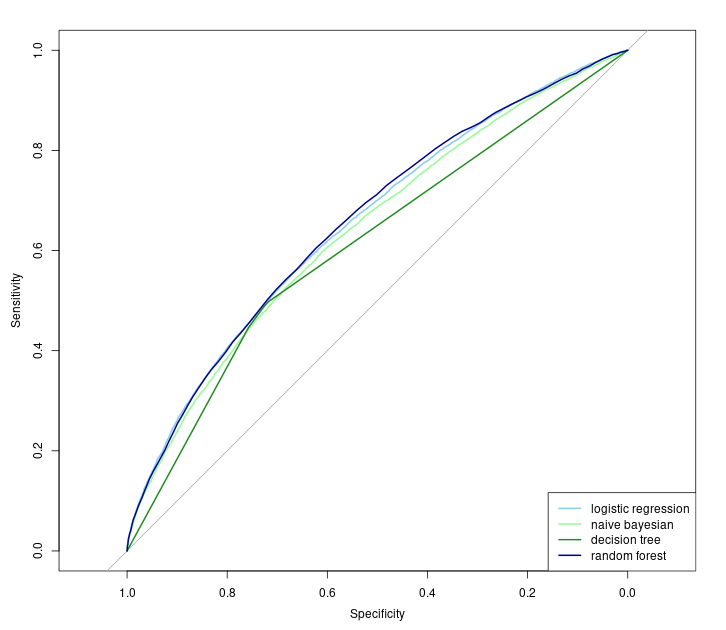

## 1.Introduction
Diabetes is a chronic disease that affects millions of people around the world, and managing diabetes can be a complex and challenging task. One important aspect of diabetes management is the prevention of hospital readmissions, as frequent readmissions can be costly$^{[1]}$ and may negatively impact patient outcomes$^{[2]}$. In this study, we aimed to develop a prediction model for readmission rates for diabetic patients using a dataset from Kaggle. We used several prediction methods, including logistic regression, naive bayesian, random forest, and K-nearest-neighbor, and evaluated their performance using AUC, ROC, and confusion matrix.

## 2.Methods

### 2.1 Study Population  
The dataset we used in this study was provided by Kaggle which contained information on diabetic patients who were hospitalized. The data range from 1999 to 2008 included a total of 101,766 samples and 50 variables, with each sample representing an unique observation of admission. The dataset included demographic and physical features for medications, number of inpatient visits and diagnoses. 

### 2.2 Data cleaning  
Before analysis, the dataset was cleaned and preprocessed to remove any missing or irrelevant data. Variables with significant imbalance in sample proportions (e.g. one of the categories accounts for >99%) were excluded. Variables with more than 40% missingness were excluded such as weight, payer code and medical specialty. We also deleted rows containing missing values in race. After exclusion, 30 variables were left.

### 2.3 Variables  
The outcome of this study is readmitted, a categorical variable that indicates days to inpatient readmission. The outcome has 3 values, “<30” or “>30” if the patient was readmitted in less or more than 30 days and “No” for no record of readmission. We convert the outcome to binary by considering “No” as 0, readmitted as 1 no matter less or more than 30 days.  
The variables diagnose 1, diagnose 2 and diagnose 3 were merged to find the 6 most frequent ICD-9 codes and considered as a new variable. For those codes with decimal points like 250.01, it belongs to the same group as 250.   
The following variables were added in this study: number_inpatient, which reflects the number of inpatient visits of the patient in the year preceding the encounter; number_enmergency, which represents the number of emergency visits; num_medications, which indicates the number of distinct generic names administered during the encounter; diabetesMed, to demonstrate if there was any diabetic medication prescribed; age, which grouped in 10-year intervals.
	
### 2.4 Descriptive analysis
Inpatient
Outpatient
Emergency
Age
diabetesMed

## 3. Methodology
To predict readmission rates, we used four different prediction methods: logistic regression, naive bayesian, random forest, and K-nearest-neighbor. 

### 3.1 Logistic Regression  
Logistic regression is a statistical method that is used to predict a binary outcome, such as whether an event will occur or not. It is based on the principle of linear regression, but the dependent variable is transformed into a binary outcome using a logistic function. Logistic regression is a linear method, which means that it makes predictions based on a linear combination of the input features. 

### 3.2 Naive Bayesian  
Naive Bayesian is a probabilistic machine learning method that is based on the principle of Bayesian probability. It is called "naive" because it assumes that all of the features in the dataset are independent of one another, which is not always the case in real-world data. Despite this assumption, naive Bayesian algorithms can still be very effective at making predictions in many situations.

### 3.3  Decision Tree  
Decision tree is a machine learning algorithm that is used to make predictions based on a tree-like model of decisions. It works by dividing the input data into smaller and smaller subsets based on the values of the input features. At each step, the algorithm chooses the feature that provides the most information about the target variable, and splits the data accordingly. The resulting tree can then be used to make predictions by following the path through the tree that leads to the most likely outcome.

### 3.4 Random Forest  
Random forest is an ensemble learning method that is used to make predictions based on the collective input of a group of decision trees. It works by creating a large number of decision trees using random subsets of the input data, and then averaging the predictions made by each tree. This can help to reduce the overall variance of the predictions, and can lead to improved predictive performance, which explains why the random forest has the best predictive performance on this study.

## 4.Results   
{width=40%}    {width=40%} 
  

{width=40%} 
{width=40%} 

This is the result of Logistic Regression

{width=60%} 

### References    
[1] Joynt, K. E., & Jha, A. K. (2012). Thirty-day readmissions—truth and consequences. *N Engl j med*, 366(15), 1366-1369.  

[2] Rubin, D. J. (2015). Hospital readmission of patients with diabetes. *Current diabetes reports*, 15(4), 1-9.
