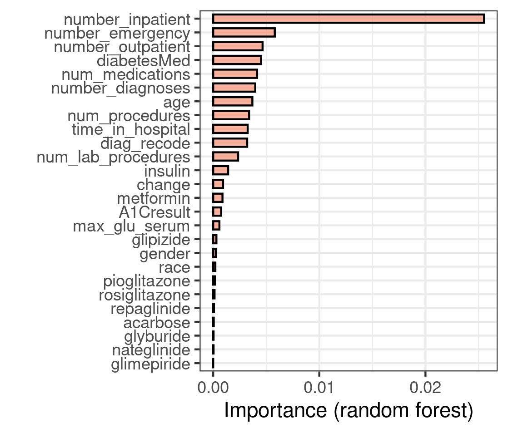
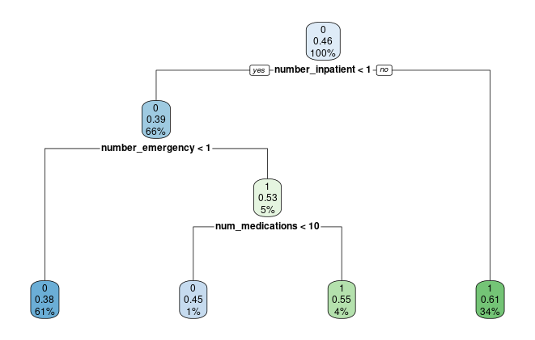

## 1.Introduction
Diabetes is a chronic disease that affects millions of people around the world with more than one tenths of Americans suffering from it. Managing diabetes can be a complex and challenging task as the overall readmission rate among diabetic patients is 18.9% $^{[1]}$, which is much higher than the readmission rate for other patients (8.5--13.5%) $^{[2]}$. One important aspect of diabetes management is the prevention of hospital readmission, as frequent readmission can be costly and may negatively impact patient$^{[3]}$ outcomes. 
In this study, we aimed to develop a prediction model for readmission rates for diabetic patients using a dataset from Kaggle. Prediction methods including logistic regression, naive bayesian, decision tree and random forest were used, and their performances were evaluated by AUC, ROC, and confusion matrix.

## 2.Methods
**2.1 Study Population **  
The dataset we used in this study was provided by Kaggle which contained information on diabetic patients who were hospitalized. The data range from 1999 to 2008 included a total of 101,766 samples and 50 variables, with each sample representing an unique observation of admission. The dataset included demographic and physical features of patients, medications, number of certain medical record and diagnoses. 


**2.2 Data cleaning**  
Before analysis, the dataset was cleaned and preprocessed to remove any missing or irrelevant data. Variables with more than 40% missingness were excluded such as weight, payer code and medical specialty. Variables that are not representative such as IDs were also excluded. We also removed variables of medications that are rarely used in patients because of their limited application to the general diabetic population. Rows containing missing values after selecting variables were directly deleted. After exclusion, there were 99492 observations with 30 variables.

**2.3 Variables**  
The outcome of this study is a categorical variable that indicates days to inpatient readmission. The outcome has 3 values, “<30” or “>30” if the patient was readmitted in less or more than 30 days and “No” for no record of readmission. We convert the outcome to binary by considering “No” as 0, readmitted as 1 no matter less or more than 30 days. The variables diagnose 1, diagnose 2 and diagnose 3 were merged to find the 6 most frequent ICD-9 codes among diabatic patients and considered them as a new variable. Those codes with decimal points belong to the same diagnosis category to its rounded value, for instance 250.01 and 250 both indicate diabate.The following variables were concluded in this study: number_inpatient, which reflects the number of inpatient visits of the patient in the year preceding the encounter; number_enmergency, which represents the number of emergency visits; num_medications, which indicates the number of distinct generic names administered during the encounter; diabetesMed, to demonstrate if there was any diabetic medication prescribed; age, which grouped in 10-year intervals.
	
**2.4 Descriptive analysis**  
Inpatient
Outpatient
Emergency
Age
diabetesMed


## 3. Methodology
To predict readmission rates, we splitted the data into training(70%) and testing(30%), and used four different prediction methods to train the dataset, including logistic regression, naive bayesian, decision tree and random forest.

**3.1 Logistic Regression**  
Logistic regression is a statistical method that is used to predict a binary outcome, such as whether a patient will be readmitted or not in this study. It is based on the principle of linear regression, which means that it makes predictions based on a linear combination of the input features. The readmission is transformed into a binary outcome using a logistic function.

**3.2 Naive Bayesia**  
Naive Bayesian is a probabilistic machine learning method that is based on the principle of Bayesian probability. It is called "naive" because it assumes that all of the features in the dataset are independent of one another, which is not always the case in real-world data. Despite this assumption, naive Bayesian algorithms can still be very effective at making predictions in many situations.

**3.3  Decision Tree**  
Decision tree is a machine learning algorithm that is used to make predictions based on a tree-like model of decisions. It works by dividing the input data into smaller and smaller subsets based on the values of the input features. At each step, the algorithm chooses the feature that provides the most information about the target variable, and splits the data accordingly. The resulting tree can then be used to make predictions by following the path through the tree that leads to the most likely outcome. In order to allow the tree to fully grow and to prune its branches afterwards, we tuned the parameters of the decision tree by grid search during the model prediction process, and used the tuned parameters to predict the readmission outcome of  test data.

**3.4 Random Forest**  
Random forest is an ensemble learning method that is used to make predictions based on the collective input of a group of decision trees. It works by creating a large number of decision trees using random subsets of the input data, and then averaging the predictions made by each tree. After plotting different numbers of trees to the error, we decided to use 100 trees in the prediction. By grid search of the parameters, mtry(number of variables randomly sampled as candidates at each split) was set to 4. 


**3.5 Model Comparison Methods**  
To evaluate the performance of the prediction models, we used three evaluation metrics: AUC, ROC, and confusion matrix. AUC (area under the curve) is a measure of the performance of a binary classification model, with a value of 1 indicating perfect performance and a value of 0.5 indicating random performance. ROC (receiver operating characteristic) is a plot of the true positive rate against the false positive rate, and is used to evaluate the performance of a binary classification model. Confusion matrix is a table that shows the number of true positive, true negative, false positive, and false negative predictions made by a classification model.


## 4.Results   
**4.1 Model Comparison**   
<p align="center">  
{width=40%}
{width=40%} 
</p>

<p align="center">
{width=40%}
{width=40%} 
</p>
<p align="center">
Figure 1: Confusion Matrices of Prediction
</p>

<p align="center">
{width=50%} &emsp;&emsp;&emsp;&emsp; {width=50%}
</p>


<p align="center">Figure 2: ROC Plot                        Figure 3: Importance of Variables</p>


<p align="center">
{width=80%}  
</p>
Figure 4: Result of Decision Tree


```{r ,echo = FALSE}
table1<- data.frame(Accuracy=c(0.615,0.587,0.612,0.616),
                    Specificity = c(0.806, 0.913, 0.757, 0.755),
                    Sensitivity = c(0.397, 0.214, 0.447, 0.457),
                    PosPredValue= c(0.641, 0.682, 0.617, 0.620),
                    NegPredValue= c(0.604, 0.570, 0.610, 0.614),
                    AUC = c(0.654,0.641,0.610,0.656))
knitr::kable(t(table1),format = "pandoc",
             caption = "Confusion Matrix Parameters and Area Under Curve",
             col.names=c("Logistic Regression","Naive Bayesian",
                         "Decision Tree","Random Forest"))
```

After conducting the prediction methods to train data and testing the model performance, we get the confusion matrices of the models. Random Forest performed the best in the testing data with an accuracy of 61.6%, while Naive Bayesian got the lowest accuracy of 58.7%. The sensitivity of each model is relatively poor, being below 50%, which means that the rate of missing diagnoses is high. Naive Bayesian got the highest specificity (91.3%), followed by logistic regression (80.6%), showing that our prediction model can recognize as many negative cases as possible, without misjudgment of readmission. Area Under Curve and ROC Plot (Figure 2) got the same result in accuracy, indicating that Random Forest got the best performance, and logistic regression was the second.

The importance of variables given by random forest prediction model is given by Figure 3. Number of inpatient visits provided the highest contribution rate, followed by the numbers of emergency and outpatient visits, indicating that the numbers of visits are the most important predictors of readmission. Comparing the decision tree results (Figure 4), we can see that the number of inpatient visits has the greatest gain in information about whether or not to be readmitted in the future, i.e., the highest purity. The decision tree selects the number of medications administered during the encounter in the third branch, indicating that this variable has a strong effect on the model. However, Random Forest combines multiple decision trees, which can help to reduce the overall variance of the predictions, which explains why the random forest has the best predictive performance on our study.

Ihe importance of variables given by random forest prediction model is given by Figure 3. Number of inpatient visits provided the highest contribution rate, followed by the numbers of emergency and outpatient visits, indicating that the numbers of visits are the most important predictors of readmission. Comparing the decision tree results (Figure 4), we can see that the number of inpatient visits has the greatest gain in information about whether or not to be readmitted in the future, i.e., the highest purity. The decision tree selects the number of medications administered during the encounter in the third branch, indicating that this variable has a strong effect on the model. However, Random Forest combines multiple decision trees, which can help to reduce the overall variance of the predictions, which explains why the random forest has the best predictive performance on our study.


**4.2 Prediction Example**  
When a patient is discharged from the hospital, we can calculate the probability of readmission based on their registration information to facilitate future follow-up arrangements. Here is a prediction example of our model. Let’s say a patient aged between 30 to 40, stayed in hospital for 2 days during the encounter, had 44 lab tests, and took 16 distinct of medications, no outpatient/emergency/inpatient visit, got 7 diagnoses, main diagnose was diabetes and took insulin, did not do blood glucose tests in the year preceding the encounter. According to the random forest model, the patient’s probability of readmission is 30.0%, while  logistic gives 37.4%, naive bayesian gives 13.8%, and decision tree gives 30.%. From model comparison results, we can use the result of random forest as the final prediction of readmission.


## 5.Conclusion and Discussion
The performance of models is not ideal. The first reason may be the quality of the data. This dataset is from 1999 to 2008 which may be hard to collect a complete dataset at that period. Glucose level is 
that may lack crucial test results such as glucose level. 
Second, other model improvement methods such as cross validation may increase the robustness of the model, which we may consider in the future.


### References    
[1] Judy Y. Chen, M.D., M.S.H.S., Qiufei Ma, Ph.D., Hua Chen, M.D., and Irina Yermilov, M.D., M.P.H.T.M. *New Bundled World: Quality of Care and Readmission in Diabetes Patients.* https://www.pharllc.com/wp-content/uploads/2019/12/Chen-J-Diabetes-Sci-Technol-2012.pdf
[2] Ostling, S., Wyckoff, J., Ciarkowski, S.L. et al. *The relationship between diabetes mellitus and 30-day readmission rates.* https://clindiabetesendo.biomedcentral.com/articles/10.1186/s40842-016-0040-x#citeas
[3] Rubin, D. J. (2015). Hospital readmission of patients with diabetes. *Current diabetes reports*, 15(4), 1-9.
